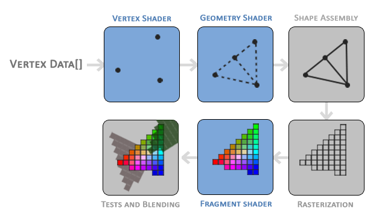

## Парадигма и архитектура WebGL

**Парадигма**

WebGl - это библиотека, только умеет только в рисование фигур, точек, линий, треугольников (все сложные 3D фигуры делаются из треугольников)



Для рисования WebGL построен вокруг следующей концепции:
1) У тебя есть сущность, которую ты хочешь нарисовать, например кружок
2) У этого кружка есть параметры (цвет, радиус, толщина линии и т.д.)
3) Допустим, мы определяем функцию, которая имеет логику отрисовки кружка
4) Для этой логики нужны данные
5) Вместо того, чтобы определить параметры для функции, мы определяем сущность, к которой будет стучаться наша функция в момент вызова.

Таким образом, парадигма WebGL заключается в том, что мы должны постоянно устанавливать его состояние через JS и вызывать `drawArray()`, которая будет запускать процесс рендера наших байт используя шейдеры, которые мы написали.

**Архитектура**


В WebGL всё начинается с контекста. 

```js
    const gl = canvas.getContext("webgl"); // canvas - инстанс <canvas> элемента
    if (!gl) {
        throw new Error("WebGL is not supported!");
    }
```

При его инициализации у нас создаётся дефолтный Vertex Array Object (VAO) и global state. WebGl опрерирует абстракцяими VAO и VBO (Vertex Buffer Object). Чтобы отрисовать что-то используя библиотеку, надо:

- создать buffer объекты и загрузить в них инфу
- эти buffer объекты впоследствии будут использоваться WebGL'ем (после вызова `drawArray()`) при вызове шейдеров, чтобы передать последним информацию о вершинах (vertices) для vertex шейдера и цвете для fragment шейдера
- привязать программу с шейдерами. (Смысл этого действия якобы в том, что мы оптимизируем скомпилированные шейдеры для выполнения их на GPU, а также чекаем возможные ошибки в написании шейдеров (ведь мы пишем их в отрыве друг от друга, а varying-переменные как-то надо проверять))

```js
    const program = gl.createProgram();
    gl.attachShader(program, vertexShader);
    gl.attachShader(program, fragmentShader);
    gl.linkProgram(program);
    const isSuccess = gl.getProgramParameter(program, gl.LINK_STATUS);
    if (isSuccess) {
        return program;
    }
```

- заранить `drawArray()`, в который передадим инфу о том какой тип фигур рисуем и сколько вершин будем иметь (это в свою очередь повлияет на то, сколько у нас должно быть инфы в VBO)


